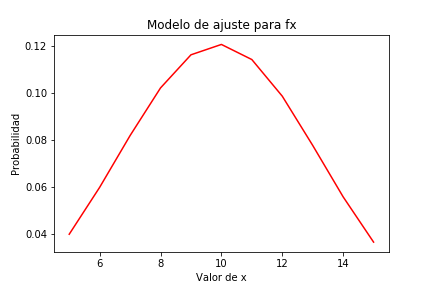
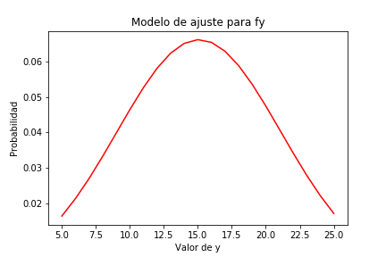
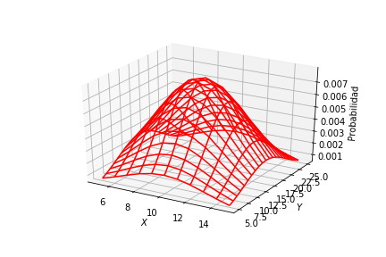

Emmanuel Chavarría Solís B51977 Tarea 3

1. Para la primera pregunta se procedió a graficar las curvas de densidad marginal sumando las
    filas y columnas para obtener fx y fy. En las figuras se puede observar cómo se asemejan en gran
    medida una curva gaussiana por lo que se procede a obtener los parámetros de mejor ajuste, a
    partir de estos parámetros se grafican las curvas de ajuste:

2. Como son independientes se puede asumir que fx,y (x,y)=fx(x)fy(y) en donde fx es representada
    por una función **gaussiana** con parámetros mu1, sigma1 y fy es representada por dos
    parámetros diferentes asociados a su función de densidad marginal, los cuales ya se habían
    encontrado en el punto anterior

Sigma para fy: 6.027; Mu para fy: 15.0 8

Sigma para fx: 3.299; Mu para fx: 9.90 5

Y además **x** varía de 5 a 15, **y** varía de 5 a 25.

3. La correlación es: 149.543 , La covarianza es: 0.183, El coeficiente de correlación es: 0.00921

La correlación es el momento de segundo orden E[XY], Tiene el símbolo Rxy y significa el grado en que
dos o más cantidades están asociadas, es importante tener en cuenta que correlación no implica
causalidad. A partir de este punto se puede observar que son independientes porque Rxy= E[X]E[Y]

Si la covarianza es cercana a cero se puede decir que son independientes, lo cual en este caso sucede:
Cxy=Rxy-E[X]E[Y]

El coeficiente de Pearson es la covarianza normalizada, ya que al dividir entre los sigmas se elimina la
desviación por lo que el valor tiene que andar en el rango de -1 a 1, lo cual se cumple en este caso.

4. Se adjuntan las gráficas pedidas en la pregunta 4:
Gráfica para la función de densidad marginal de fx:

Gráfica para la función de densidad marginal de fy:

Gráfica para la función de densidad conjunta:

